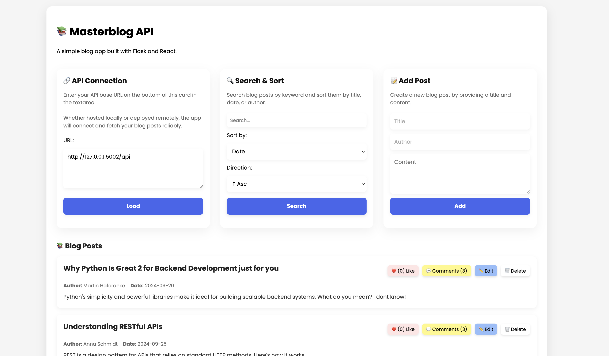

# Masterblog-API 🧠📝

A modular, fullstack Flask application with a JSON-backed blog API and a minimal frontend – featuring CRUD operations, likes, comments, and clean API architecture.

---

## 🔍 Project Description

Masterblog-API is a Flask-based blog system that exposes a fully RESTful backend for managing blog posts, along with a lightweight frontend for display. Posts are stored locally in a JSON file, and users can interact with them via HTTP requests or through the UI. The architecture separates backend, frontend, and utility logic cleanly using Flask blueprints and an application factory pattern.

---


## ✨ Features

- 🧩 RESTful CRUD API for blog posts
- ❤️ Like and 💬 comment functionality
- 🔍 Search, sort, and filter capabilities
- 🔐 Rate limiting with Flask-Limiter 
- 🧱 JSON-based persistent post storage
- 🖥 Simple HTML interface rendered via Jinja2
- 📜 Swagger UI documentation  

---

## Preview:

---

## 🛠️ Tech Stack

- Python 3.11+
- Flask (API & Frontend)
- Flask-Limiter, Flask-CORS, Flask-Swagger-UI
- HTML (Jinja2 templating)
- Vanilla JS
- JSON for data storage

---

## 🧱 Project Structure

```
.
├── backend/
│   ├── config/
│   │   ├── init.py
│   │   ├── config.json             # JSON-based runtime settings
│   │   └── loader.py               # Config loading & warnings
│   ├── data/
│   │   └── posts.json              # Blog post storage
│   ├── static/
│   │   └── masterblog.json         # Static API example or template data
│   ├── utils/
│   │   ├── init.py
│   │   ├── helpers.py              # Get post by ID
│   │   ├── json_io.py              # Read/write posts.json
│   │   ├── parsers.py              # Request parsing (e.g. query params)
│   │   └── validators.py           # Validation logic
│   ├── app_factory.py              # create_app() with Swagger, Limiter, Logging
│   ├── backend_app.py              # API route definitions
│   └── app.log                     # Backend logging output
├── frontend/
│   ├── static/
│   │   ├── main.js                 # Like & comment interaction
│   │   └── styles.css              # UI styling
│   ├── templates/
│   │   └── index.html              # Blog post UI
│   └── frontend_app.py             # Flask app serving the frontend
```

## 🚀 Getting Started

### 1. Clone the Repository

```bash
git clone https://github.com/ItsHarfer/Masterblog-API.git
cd Masterblog-API
```

### 2. Install Requirements
```
pip install -r requirements.txt
```

### 3. Start Backend and Frontend
```
python backend/backend_app.py      # API server at http://localhost:5002
python frontend/frontend_app.py    # Frontend UI at http://localhost:5007
```

## 🔧 Example API Operations

- `GET /api/posts` – Retrieve all blog posts  
- `POST /api/posts` – Create a new post  
- `PUT /api/posts/<id>` – Update a post  
- `DELETE /api/posts/<id>` – Delete a post  
- `POST /api/posts/<id>/like` – Like a post  
- `POST /api/posts/<id>/comment` – Add a comment  
- `GET /api/posts/search` – Search by title/content/author/date

---

## 📚 API Documentation (Swagger UI)

The project includes Swagger UI for testing and exploring the API.

To access it, start the backend and open:
```
http://localhost:5002/api/docs
```
You can try out all endpoints directly in the browser.

> ℹ️ Swagger UI is mounted via `flask_swagger_ui` in `app_factory.py`.

---

## 🌐 CORS Note

The frontend and backend are **served from different ports**, which makes Cross-Origin Resource Sharing (CORS) necessary.

This project uses **Flask-CORS** to allow communication between:

- `http://localhost:5007` (Frontend)
- `http://localhost:5002` (Backend)

If you deploy the frontend and backend on different hosts or devices, make sure to configure CORS policies accordingly in `app_factory.py`.

---

## 📋 Requirements

All dependencies are listed in `requirements.txt`. Key packages:

- `Flask`
- `Flask-Limiter`
- `Flask-CORS`
- `Flask-Swagger-UI`

---

## 👤 Author

Martin Haferanke  
GitHub: [@ItsHarfer](https://github.com/ItsHarfer)  
Email: `martin.haferanke@gmail.com`

---

## 📄 License

Licensed under the MIT License.  
This project is intended for learning, demonstration, and rapid prototyping purposes.